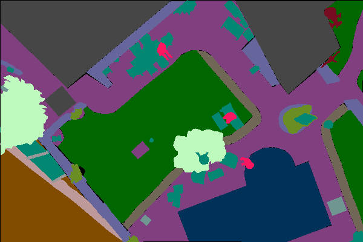
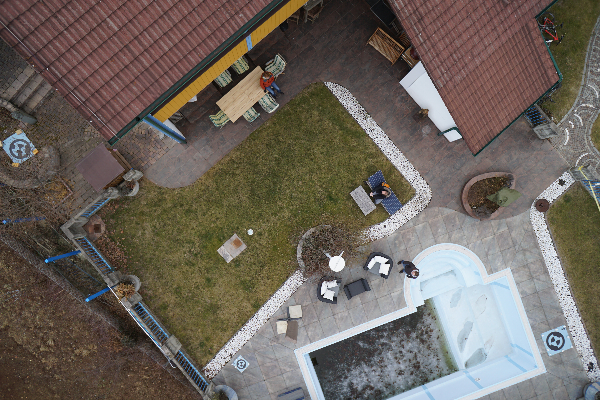
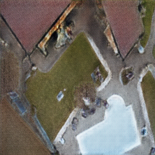
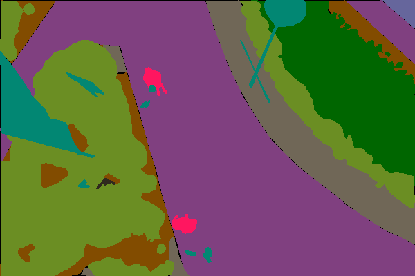
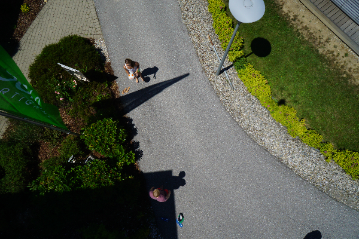
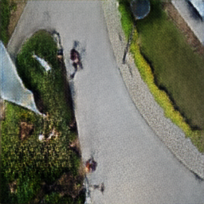

# Pix2Pix — TU-Graz UAV Landing

Generates realistic aerial photographs from semantic label maps using Pix2Pix.  
*Computer Vision II · Master in AI · TU Graz 2025/2026*

---

## Installation

```bash
pip install torch torchvision pillow customtkinter
```

---

## How to use

### Option 1 — Command line

```bash
python inference.py --input samples/image_004.png --model checkpoints/improved/exp_P2_full/best_G.pth --output result.png
```

Pass any label map as `--input`. The model architecture is detected automatically.

### Option 2 — Desktop GUI

```bash
python gui.py
```

Opens a window where you can load any label map and run all models at once to compare their outputs side by side.

---

## Sample images

The `samples/` folder has 5 ready-to-use test images:

| Label map (input) | Real photo | Generated by best model |
|:-----------------:|:----------:|:-----------------------:|
|  |  |  |
|  |  |  |

Each image comes in three versions:  
`image_XXX.png` → label map &nbsp;|&nbsp; `real_image_XXX.png` → ground truth &nbsp;|&nbsp; `generated_image_XXX.png` → model output

---

## Results

| Model | Architecture | PSNR | SSIM |
|-------|-------------|------|------|
| Baseline | U-Net · L1 + GAN | 18.64 dB | 0.635 |
| exp_P1_l1 | U-Net · L1 + GAN | 15.49 dB | 0.279 |
| exp_P1_perc | U-Net · Perceptual | 15.87 dB | 0.288 |
| exp_P1_fm | U-Net · Perceptual + FM | 15.99 dB | 0.298 |
| exp_P2_aug | U-Net · FM + Aug | 15.79 dB | 0.284 |
| **exp_P2_full** | **ResNet-18 · FM + Aug + TL** | **17.02 dB** | **0.328** |

The baseline PSNR looks higher because L1-only training produces blurry outputs that score well pixel-by-pixel. The improved models generate sharper textures at the cost of a lower pixel-level score.

---

## References

- Isola, P., Zhu, J.-Y., Zhou, T., & Efros, A. A. (2017). *Image-to-image translation with conditional adversarial networks*. CVPR.
- TU-Graz Safe UAV Landing dataset: https://www.tugraz.at/index.php?id=22387
